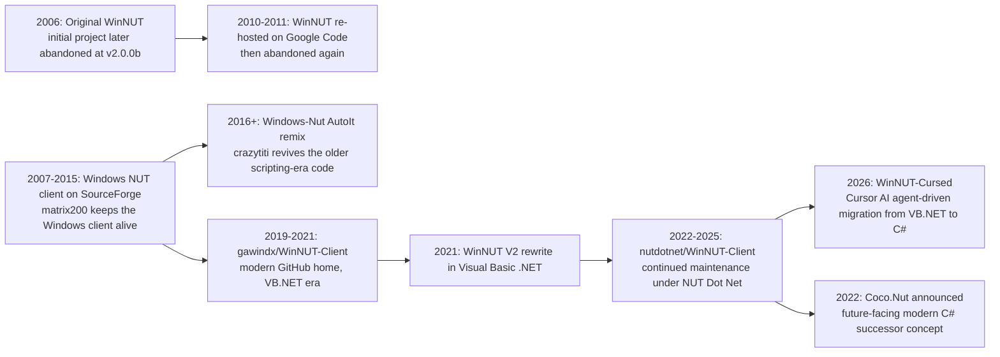

# WinNUT-Cursed

`WinNUT-Cursed` is a working migration repo focused on using Cursor AI agents to move the current WinNUT V2 codebase from Visual Basic .NET to C# in 2026. The original V2 rewrite was done in Visual Basic, and this repository now tracks the in-progress conversion of that WinForms client, shared logic, build assets, and installer flow into a C#-first solution while keeping behavior aligned with the existing application.

The migration is already well underway: the new `WinNUT.Client` and `WinNUT.Client.Common` C# projects exist, many former VB.NET source files now have C# counterparts, and the GitHub Actions/build plumbing is being updated alongside the code. The work is not finished yet, but the repo is clearly in the middle of a real source-to-source transition rather than a greenfield rewrite.

## Project Lineage

This repository is a fork of [nutdotnet/WinNUT-Client](https://github.com/nutdotnet/WinNUT-Client). That project was previously moved over from [gawindx/WinNUT-Client](https://github.com/gawindx/WinNUT-Client), where much of the modern WinNUT V2 Visual Basic .NET work was maintained. Looking further back, the broader WinNUT history also traces through older WinNUT and Windows NUT client efforts, including the earlier AutoIt-era lineage documented by the original project history on [SourceForge](https://sourceforge.net/projects/winnutclient/) and by [Network UPS Tools related projects](https://networkupstools.org/projects.html).

## Timeline

| Period | Incarnation | Main tech / home | Notes |
| --- | --- | --- | --- |
| 2006 | Original `WinNUT` | Early Windows client | The NUT project history says the original project was abandoned in 2006 at version `2.0.0b`. |
| 2007-2015 | `Windows NUT client` | SourceForge / Windows desktop client | The broader Windows client line was hosted on SourceForge by `matrix200` and carried the project name forward. |
| 2010-2011 | `WinNUT` re-host | Google Code archive | The NUT project history says the older `WinNUT` codebase was re-hosted on Google Code in 2010 and abandoned again in 2011. |
| 2016+ | `Windows-Nut` | AutoIt remix | `crazytiti/Windows-Nut` describes itself as a remix of the original Windows NUT client. |
| 2019-2021 | `gawindx/WinNUT-Client` | GitHub / Visual Basic .NET era | This is the modern GitHub-era WinNUT home credited to Gawindx (Decaux Nicolas). |
| 2021 | `WinNUT-Client V2` | Visual Basic .NET rewrite | The local changelog records version `2.0.0.0` as a complete rewrite of WinNUT in Visual Basic. |
| 2022-2025 | `nutdotnet/WinNUT-Client` | GitHub / NUT Dot Net stewardship | The project moved into the `nutdotnet` organization for ongoing maintenance and releases. |
| 2022 | `Coco.Nut` | Future-oriented C# concept | Announced by the maintainers as the longer-term modern successor direction rather than a direct continuation of this WinForms codebase. |
| 2026 | `WinNUT-Cursed` | Cursor AI migration repo | This repository focuses on translating the existing VB.NET WinForms application into C# while preserving behavior. |

## Current Focus

- Preserve the existing WinNUT desktop behavior while porting the implementation to C#.
- Migrate shared protocol, updater, and legacy settings code into reusable C# projects.
- Convert WinForms UI forms and controls without losing installer, publishing, or localization support.
- Use Cursor AI agents as the main acceleration layer for refactors, code translation, cleanup, and build-system updates.

## Credits And Copyright

Credit for the previous WinNUT codebase and project stewardship belongs to the earlier maintainers and contributors, especially:

- Copyright (C) 2019-2021 Gawindx (Decaux Nicolas)
- Copyright (C) 2022+ NUT Dot Net project

This repository exists because of the earlier WinNUT work, especially [nutdotnet/WinNUT-Client](https://github.com/nutdotnet/WinNUT-Client) and [gawindx/WinNUT-Client](https://github.com/gawindx/WinNUT-Client). If you are looking for the broader next-step discussion around the future of the project rather than this C# migration effort, see [Coco.Nut](https://github.com/nutdotnet/Coco.Nut).

## Third-Party Components

WinNUT uses or has historically used:

- a modified version of [AGauge](https://github.com/Code-Artist/AGauge) under the [MIT License](https://opensource.org/licenses/MIT)
- the IniReader class by [Ludvik Jerabek](https://www.codeproject.com/Articles/21896/INI-Reader-Writer-Class-for-C-VB-NET-and-VBScript) under [The Code Project Open License](http://www.codeproject.com/info/cpol10.aspx)
- [Newtonsoft.Json](https://www.newtonsoft.com/json) under the [MIT License](https://opensource.org/licenses/MIT)

## License

This program is free software: you can redistribute it and/or modify it under the terms of the GNU General Public License as published by the Free Software Foundation, either version 3 of the License, or any later version.

This program is distributed in the hope that it will be useful, but WITHOUT ANY WARRANTY.